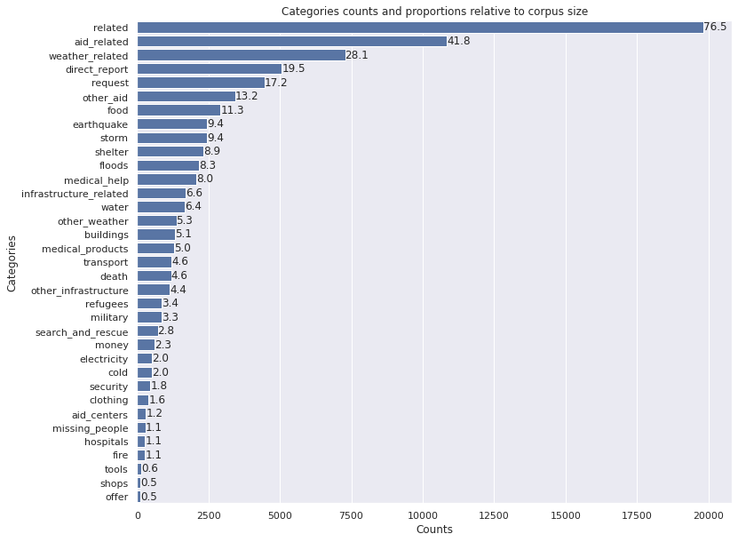
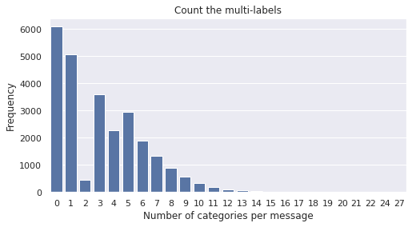

# Disaster pipeline and web app
===================================

## [Web App with Flask and Heroku](https://distresapp.herokuapp.com/)
====================================

Project Structure
------------

    ├── LICENSE
    ├── README.md          <- The top-level README for developers using this project.
    |
    ├── data
    │   ├── disaster_categories.csv  <- Databases created from data files.
    │   ├── disaster_messages.csv    <- Intermediate data that has been transformed.
    │   ├── DisasterResponse.db      <- Database created from pre-processed data.
    │   ├── DisasterResponseOpt.db   <- Database created from pre-processed data, no label messages removed.
    │   └── process_data.py.         <- ETL Pipeline.
    │
    ├── models                   <- Trained and serialized models, pipelines.
    │   ├── ada_model.pkl        <- Serialized model with AdaBoost.
    │   ├── classifier.pkl       <- Serialized final model.
    │   ├── essentials.py        <- Contains the tokenizer.
    │   ├── __init__.py          <- Makes models a Python module.
    │   ├── train_classifier.py  <- ML Pipeline
    │   └── xgb_model.pkl        <- Serialized model with XGBoost.
    │
    ├── notebooks                           <- Jupyter notebooks.
    |   ├── ML_Pipeline_Preparation.ipynb   <- ML Pipeline preliminary work.
    │   └── ETL_Pipeline_Preparation.ipynb  <- ETL Pipeline preliminary work.
    │
    ├── figures            <- Generated graphics to be used in reporting.
    │  
    ├── requirements.txt   <- The requirements file for reproducing the analysis environment.
    │
    ├── distressapp        <- Code for the web app.
    │   ├── __init__.py    <- Makes distressapp a Python module.
    │   │
    │   ├── templates        <- Scripts for web pages.
    |   |   ├── go.html      <- Handles user query and displays model results.
    │   |   └── master.html  <- Web page with plotly graphs.
    │   │
    │   ├── essentials.py       <- Contains the tokenizer.
    │   │
    │   ├── run.py    <- Scripts that processes all steps for Flask application.
    |
    ├── .gitignore      <- Files to be ignored by Git.
    ├── .slugignore     <- Files to be ignored by Heroku.
    ├── Procfile        <- Contains gunicorn command to build Heroku app.
    ├── nltk.txt        <- List of NLTK corpora to be installed by Heroku.
    ├── essentials.txt  <- Contains the tokenizer.  
    │
    └── distress.py     <- Contains the command to run the web app.

--------

# Outline of CRISP-DM methodology implementation

## Domain Background

Following a disaster there are millions of communications produced by either direct channels or via social media. During this time, the disaster response organizations have the least capacity to filter and then pull out the relevant messages, which often might be on a ratio of one to thousands of messages.

To optimize the disaster response and aid, different organizations take care of different aspects of the problem, such as: water supply, blocked roads, medical supplies, etc. In order to classify these messages on categories, a machine learning approach is by far superior to a simple keyword search. To see this consider the example of water supply; the word water does not always appear in this kind of messages, as the people might mention thirst instead.

## Problem Statement

Given a large set of text documents (disaster messages), perform multi-label classification, using supervised machine learning methods. The outcome should provide a list of  categories each message that is typed in an API belongs to.

## Data Understanding

The data consists of about 26000 messages (given in _disaster_messages.csv_)
together with the corresponding labels (given in _disaster_categories.csv_). The dataset is provided by [Figure Eight, Inc.](https://en.wikipedia.org/wiki/Figure_Eight_Inc.), now part of [Appen](https://appen.com/solutions/nlp-and-speech-technology/).

 The dataset contains messages collected during and after many real life disasters. The individual message collections were combined and relabeled so that they would have consistent labels across the different disasters.

 From a bird's eye view of the data see the charts below:

 - there are 35 categories;
 - the data is highly imbalanced;
  
 - there are numerous messages with no associated category;
 - most of the labelled messages belong to more than one category.
 

## Solution Statement

The primary goal of this analysis is to automatically characterize a message given to an API. In order to achieve this goal we plan to use:

- text processing techniques (from NLTK library) such as tokenization and lemmatization,
- use a Random Forest Classifier with default settings as a benchmark model,
- employ an AdaBoost Classifier wrapped in a MultiOutput Classifier with hyperparameters tunned via a Grid Search with Cross Validation,
- create a web app with Flask which includes relevant visuals of the data built with Plotly,
- deploy the web app on the Heroku platform.

## Evaluation Metrics

Since the set is highly imbalanced, we will use precision, recall and F1 scores to evaluate the models, although individual class accuracies will also be computed in some cases.

These 35 categories scores are averaged using various methods. A macro-average computes the metric independently for each class and then takes the average hence treating all classes equally, whereas a micro-average aggregates the contributions of all classes to compute the average metric. With the large classes performing better than the small ones, we expect to see the micro average being higher than the macro average.

The micro-average is not sensitive to the predictive performance for individual classes and it can be misleading when the class distribution is imbalanced. A large value of the F1 macro indicates that a classifier performs well for each individual class, which makes the macro-averaging technique more suitable for data with an imbalanced class distribution.

## Data Loading and Preparation

The following steps are part of ETL pipeline - see _process_data.py_.

1. Load the "disaster_messages.csv" and "disaster_categories.csv" as pandas dataframes.
2. Parse the "disaster_categories" that contains a column with lists of strings (categories) by transforming it into corresponding binary columns, one for each category.
3. Merge the two dataframes.
4. Drop unnecessary features, including a zero variance category (_child_alone_).
5. Drop duplicates.
6. Store the clean dataset it in a SQLite database: "DisasterResponse.db".

## Modeling

The following steps are part of the NLP and ML pipelines - see _train_classifier.py_.

1. Load the dataset from the database.
2. Separate the text messages from the labels (categories).
3. Create a text processing function that:
    - removes punctuation signs,
    - normalizes to lowercase,
    - tokenizes the text,
    - lemmatizes the text.
4. Transforms the lists of tokens into vectors using the combo of the CountVectorizer() and TdIdfTransformer().
5. Trains an AdaBoostClassifier() wrapped in an MultiOutputClassifier().
6. Outputs the metrics (precision, recall, F1) for each class individually and their various average values.
7. Exports the final model as a pickle file.

## Flask Web App and Heroku Deployment

The main page of the app contains a place to type in the message to be classified. It also contains several visualizations created with Plotly.
The webapp is deployed online on the Heroku platform at:

https://distresapp.herokuapp.com/

## Challenges and Comments

### Imbalanced Dataset

As mentioned before, the dataset is highly imbalanced. There are categories which contain about 100 messages while the larger classes have thousands of messages. The imbalance is the major factor that affects the performance of the model. It can be addressed by re-sampling the data:

-  use standard methods as direct under-sampling and over-sampling;
-  use more advanced data augumentation techniques, such as SMOTE.

Another approach is to use a ChainClassifier() in conjunction with an XGBoostClassifier(). The chain algorithm classifies the data in each class while still taking into account the correlations between labels. This method was tested in the preliminary analysis and can be found in the Jupyter Notebook ML_Pipeline_Preparation. The F1 average scores were almost the same with the ones for the XGBClassifier and AdaBoostClassifier, showing that there is not too much advantage in using it in this case.

### Unlabelled Data

About 25% of the data has no categories associated to it, and it corresponds exactly to those messages that have 0 in the _related_ category. One strategy could be to chain a binary classifier on the _related_  category with a multi-class classifier on the remaining categories.

### Other Ways to Improve the Performance

I think that the best way to improve the performance of the model is to use a pre-trained word embedding using BERT (or a similar transformer based model) and deep learning algorithms.

### Comments Regarding the Web Deployment

There are several challenges when building the Heroku app:

- The app runs locally but it does not run on Heroku. It gives  

 `AttributeError: module '__main__' has no attribute 'tokenize'`.  

 The error is create by loading the unpickled model, as pickle does not save the same instance of a class. To solve this issue the tokenizer function was moved to a separate Python file "essentials.py", then it is imported in both the file where the model is trained and pickled and in the file where it is unpickled. For more details see this [StackOverflow issue](https://stackoverflow.com/questions/53936736/my-flask-app-does-not-run-on-heroku-but-it-runs-locally).

- The second issue encountered with the web app is the size of the Heroku slug. From the analysis in the ML_Pipeline_Preparation notebook we can see that an XGBoostClassifier has a slight advantage over the AdaBoostClassifier. However, the imports neccessary to run XGBoost are over 100 MB which take too much of the alloted 500 MB and makes the app to crash due to large Heroku slug size.

## Installation and Running Locally

- Create an environment via: `pip install requirements.txt`.
- Clone the repository at: https://github.com/SolanaO/distress_pipe.

Run the following commands in the project's root directory:

- run ETL pipeline that cleans data and creates the database  
`python data/process_data.py data/disaster_messages.csv data/disaster_categories.csv data/DisasterResponse.db`

- run ML pipeline that processes text and creates the model  
`python models/train_classifier.py data/DisasterResponse.db models/classifier.pkl`

- run the app locally (need to uncomment the command `app.run` in "distress.py")
`python distress.py`

## Acknowledgments

Thanks to [Udacity](udacity.com) for suggesting the problem and to Figure Eight for providing the data.
